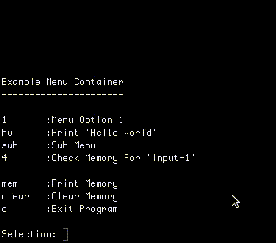

## Java-Menu-Container

### About

I got tired of having to write custom console menus for all of my projects. For sake of simplicity I needed a generic menu container capable of traversing numerous levels and was also capable of storing generic data that can be used across the menu. The JMC is a product of these requirements and allows you to easily create a full working menu that will work with any project requirement. The idea here is simple, the menu takes care of storing information and interacting with the user and you implement the rest.

### How it works

The JMC relies on two actions, either traversing to a sub-menu or performing an action. Looking at the example code in `src/Main.java`, actions are registered as callbacks. Menu entries with no action attached are assumed to traverse to another sub-menu. Callbacks do three things. First they provide access to a list of user inputs. The total number of inputs is specified by adding input instructions (see example code). Next the callback provides access to the menu's memory. Here you can store information, delete it, and retrieve it. For sake of convenience all information is stored as a String type. Lastly, each callback returns a String. This is for reporting back to the user either errors or success information about the action they just performed.

### Example code

Take a look at the example code in `src/Main.java`. There are several examples of sub-menus, performing actions, working with memory, asking the user for input, and reporting back to the user.

### Run & Compile Example Code

* Clone this repo to your local machine.
* Navigate using your console to the `src/` directory. 
* Type `make`.
* Run with, `java Main`.

### License
Copyright (c) 2015 Robert Timm

Permission is hereby granted, free of charge, to any person obtaining a copy of this software and associated documentation files (the "Software"), to deal in the Software without restriction, including without limitation the rights to use, copy, modify, merge, publish, distribute, sublicense, and/or sell copies of the Software, and to permit persons to whom the Software is furnished to do so, subject to the following conditions:

The above copyright notice and this permission notice shall be included in all copies or substantial portions of the Software.

THE SOFTWARE IS PROVIDED "AS IS", WITHOUT WARRANTY OF ANY KIND, EXPRESS OR IMPLIED, INCLUDING BUT NOT LIMITED TO THE WARRANTIES OF MERCHANTABILITY, FITNESS FOR A PARTICULAR PURPOSE AND NONINFRINGEMENT. IN NO EVENT SHALL THE AUTHORS OR COPYRIGHT HOLDERS BE LIABLE FOR ANY CLAIM, DAMAGES OR OTHER LIABILITY, WHETHER IN AN ACTION OF CONTRACT, TORT OR OTHERWISE, ARISING FROM, OUT OF OR IN CONNECTION WITH THE SOFTWARE OR THE USE OR OTHER DEALINGS IN THE SOFTWARE.
